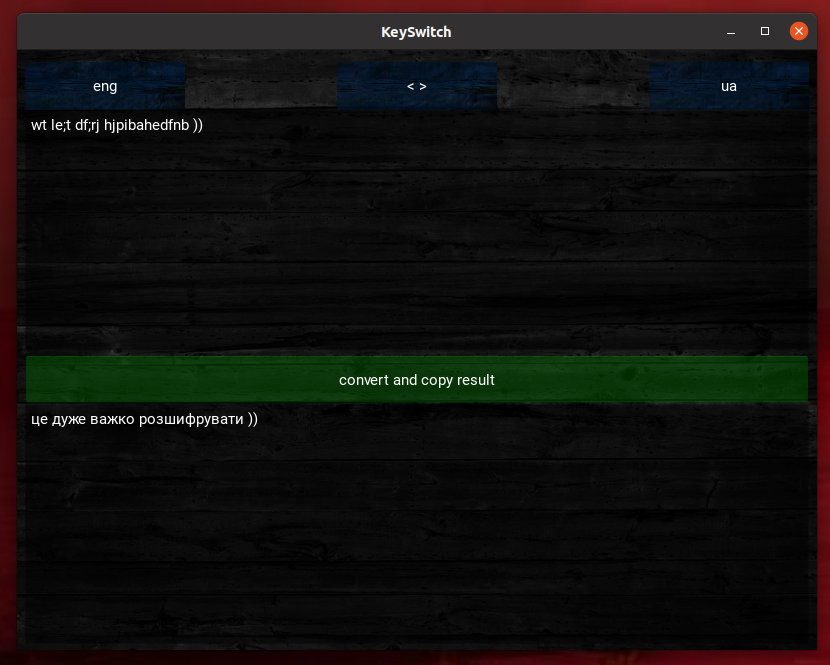

# KEYSWITCH



## 🤨 Навіщо ?:
щоб конвертувати англійські символи в нормальну українську мову за qwerty розкладом

## 🤓 Опис:
Набридло бути рикроленим клавіатурою ??? це більше не проблема! конвертуйте англійські символи в нормальну українську мову ! будьте круті!

## ☠️ Використані технології:
- все написано на PYTHON
- GUI на KIVY

## 🌱 Структура проекта:
- `build/` — тут лежить готова програма (EXE для windows)
- `img/` - фото які необхідні для роботи програми
- `screenshots/` — непотрібна для роботи програми, зберігаються лише скраншоти роботи програми
- `convertor.py` — модуль для конвертації англайської розкладки в українську і навпаки
- `rules.py` — база даних для назначення конвертації клавіш
- `main.py` — головний файл, його можна запускати


## 😎 Як це запустити легко і зручно ?:
1. скачуємо файл `build/KeySwitch.exe`
2. запускаємо цей файл подвійним нажаттям мишки на ньому (або через WINE, привіт лінуксоїди гурмани, віновс користувачі просто проігноруйте це що в дужках, вам непотрібне ніяке вино)

## 😎 Як це запустити із ісходних файлів ?:
1. встановлюємо необхідні пакети
```bash
sudo apt update
sudo apt install python3
sudo apt install python3-pip python3-dev libsdl2-dev libsdl2-image-dev libsdl2-mixer-dev libsdl2-ttf-dev libportmidi-dev libswscale-dev libavformat-dev libavcodec-dev zlib1g-dev libgstreamer1.0-0 gstreamer1.0-plugins-base gstreamer1.0-plugins-good
pip install "kivy[base]"
```
2. запускаємо програму
```bash
python3 main.py
```

## ❓ Швидкі питання і відповіді
1. "воно потрібне ?" - "да..."
